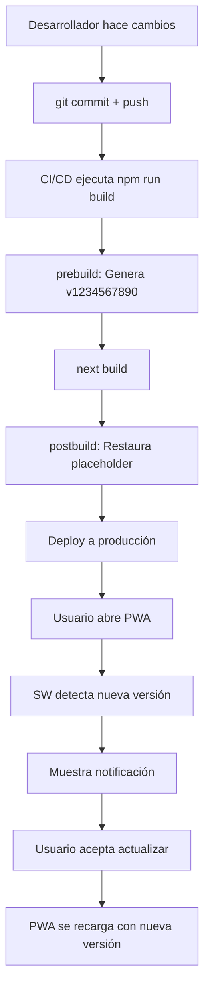

# Sistema de Actualización Automática PWA

## 🎯 Objetivo

Actualizar automáticamente la PWA cuando se hace commit y deploy de nuevos cambios, sin necesidad de reinstalar la aplicación.

## 🔧 Cómo Funciona

### 1. **Versionado Automático**

Cada vez que ejecutas `npm run build`:

1. **Pre-build**: Script `update-sw-version.js` genera un timestamp único
2. **Build**: Next.js compila la aplicación
3. **Post-build**: Script `restore-sw-template.js` restaura el placeholder para git

```bash
npm run build
# 🔧 Actualizando versión del Service Worker...
# 📦 Nueva versión: v1728912345678
# ✅ Service Worker actualizado exitosamente
```

### 2. **Estrategias de Caché**

El Service Worker usa diferentes estrategias según el tipo de contenido:

#### 📄 Network-First (HTML/Rutas de la app)
```javascript
// Siempre intenta obtener la última versión desde la red
// Si falla, usa caché como fallback
- Páginas HTML
- Rutas Next.js (_next/data/)
- Ruta principal (/)
```

#### 🎨 Cache-First (Assets estáticos)
```javascript
// Usa caché primero, solo descarga si no existe
- Imágenes
- Fuentes
- JavaScript/CSS
- Assets de Next.js (_next/static/)
```

#### 🔄 Stale-While-Revalidate (Otros recursos)
```javascript
// Sirve desde caché inmediatamente
// Actualiza en segundo plano para la próxima vez
- API calls
- Otros recursos dinámicos
```

### 3. **Detección y Notificación de Actualizaciones**

```typescript
// register-sw.tsx
- Verifica actualizaciones cada 30 minutos
- Verifica al inicio después de 10 segundos
- Detecta nuevo Service Worker
- Muestra notificación toast al usuario
```

**Notificación al usuario:**
```
┌─────────────────────────────────────┐
│ ¡Nueva versión disponible! 🎉      │
│                                     │
│ Hay una actualización de la app.    │
│ Recarga para ver los cambios.       │
│                                     │
│ [Actualizar Ahora]    [Después]    │
└─────────────────────────────────────┘
```

### 4. **Actualización Inmediata**

Cuando el usuario hace clic en "Actualizar Ahora":

1. Envía mensaje `SKIP_WAITING` al nuevo Service Worker
2. El SW toma control inmediatamente
3. La página se recarga automáticamente
4. Se muestra la nueva versión

## 📋 Flujo Completo



## 🚀 Uso

### Para Desarrollo

```bash
# Desarrollo normal (sin actualizar versión)
npm run dev

# Actualizar versión manualmente
npm run update-sw
```

### Para Producción

```bash
# Build automático con versionado
npm run build

# La versión se actualiza automáticamente
# El template se restaura automáticamente
```

### Después del Deploy

1. El usuario abre la PWA (versión antigua instalada)
2. Después de 10 segundos, verifica actualizaciones
3. Detecta nuevo Service Worker
4. Muestra notificación
5. Usuario hace clic en "Actualizar Ahora"
6. ¡Listo! App actualizada sin reinstalar

## 🔍 Verificación

### En DevTools

```javascript
// Abre Console en Chrome DevTools
navigator.serviceWorker.getRegistrations().then(regs => {
  regs.forEach(reg => console.log(reg))
})

// Ver caché actual
caches.keys().then(keys => console.log(keys))
// Output: ["control-ventas-static-v1728912345678", ...]
```

### Logs en Consola

```
✅ Service Worker registered successfully
🔄 Checking for SW updates...
🆕 New Service Worker found!
SW State: installing
SW State: installed
🔔 Update available - notifying user
```

## 📝 Archivos Clave

```
ventas/
├── public/
│   └── sw.js                    # Service Worker con placeholder
├── app/
│   └── register-sw.tsx          # Registro y detección de updates
├── scripts/
│   ├── update-sw-version.js     # Genera versión única
│   └── restore-sw-template.js   # Restaura placeholder
└── package.json                 # Scripts pre/post build
```

## ⚠️ Importante

- **NO editar manualmente** la versión en `sw.js`
- El archivo siempre debe tener `BUILD_TIMESTAMP` como placeholder en git
- Los scripts se ejecutan automáticamente con `npm run build`
- La versión se genera solo en build, no en desarrollo

## 🐛 Troubleshooting

### La PWA no se actualiza

1. Abre DevTools → Application → Service Workers
2. Click en "Unregister"
3. Application → Storage → Clear site data
4. Recarga la página (Ctrl + Shift + R)

### Ver versión actual

```javascript
// En Console
caches.keys().then(keys => {
  const version = keys[0]?.split('-').pop()
  console.log('Versión actual:', version)
})
```

### Forzar actualización manual

```javascript
// En Console
navigator.serviceWorker.getRegistration().then(reg => {
  reg.update()
})
```

## ✅ Beneficios

- ✨ **Actualización automática** sin reinstalar
- 🔄 **Versiones únicas** en cada build
- 📢 **Notificaciones** claras al usuario
- 🎯 **Estrategias optimizadas** por tipo de contenido
- 🚀 **Experiencia fluida** para el usuario
- 🔧 **Fácil mantenimiento** para el desarrollador

